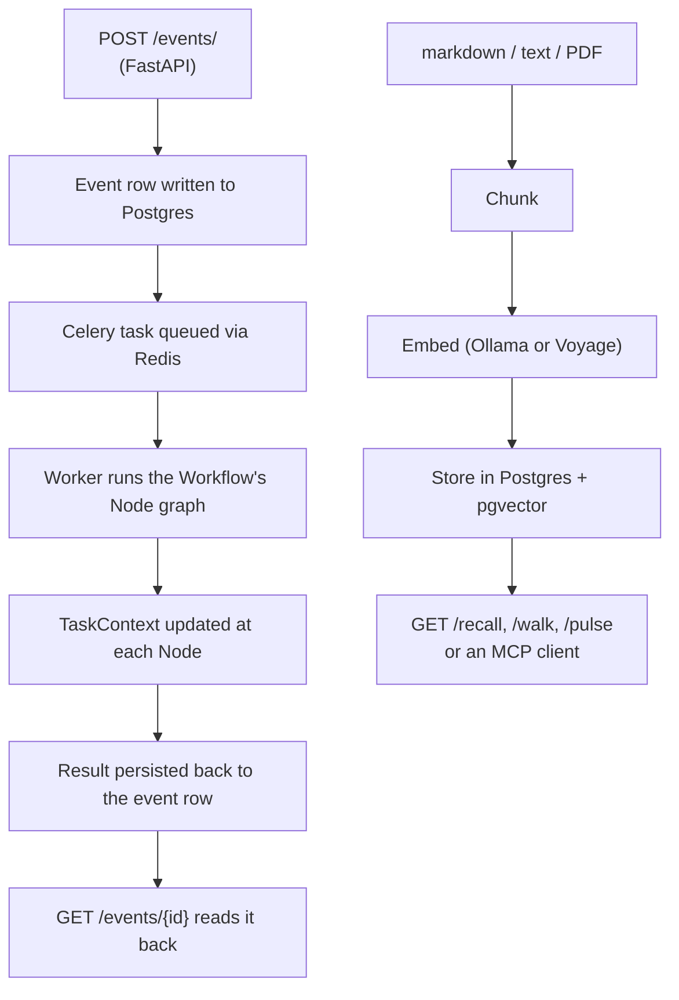

# Synapse

An event-driven AI pipeline framework for Python: FastAPI accepts an event, persists it to
PostgreSQL, and queues it onto Celery (Redis as the broker). A worker then runs the event through
a **workflow** — a validated directed graph of **nodes**, each a small unit of work (call an LLM,
chunk a document, write a database row) — passing a shared state object (`TaskContext`) from node
to node. New workflows are added as sibling directories; nothing about the framework core changes
to add one.

The same service also runs "Synapse" proper: a retrieval-augmented corpus. Markdown documents are
chunked, embedded, and stored in Postgres with [pgvector](https://github.com/pgvector/pgvector) so
they can be searched semantically and traversed as a linked graph (a document's `related:` links
become edges you can walk). Source files can be indexed the same way, as a separate `code` corpus
chunked at function and class boundaries. This half of the service is internally called "the
Brain" — it is the part a consumer queries for answers, not the part that runs workflows.

## What this is for

Use this repo as:

- **A workflow engine** — trigger a long-running AI job over HTTP, poll for its result, and add
  new job types without touching the dispatch/queueing plumbing.
- **A small RAG (retrieval-augmented generation) service** — ingest markdown/text/PDF content,
  then query it back by meaning (not just keyword) over HTTP or as an
  [MCP](https://modelcontextprotocol.io/) server.

It is not a general job scheduler and it is not a vector database on its own — it is the glue
between FastAPI, Celery, and Postgres/pgvector that makes both of the above practical to build on.

## Quickstart

Everything below is typed in a **shell terminal**, from the repo root, in order.

```bash
# 1. Install Python dependencies (uv manages the virtualenv for you)
curl -LsSf https://astral.sh/uv/install.sh | sh   # skip if you already have uv
uv sync

# 2. Copy env files and fill in the values described in the table below
cp app/.env.example app/.env
cp docker/.env.example docker/.env

# 3. Bring up Postgres + Redis (Docker path — see "Two ways to run it" for a local/Homebrew path)
cd docker && ./start.sh && cd ..

# 4. Apply database migrations
cd app && uv run alembic upgrade head && cd ..

# 5. Run the API (separate terminal: also start the worker, see below)
cd app && uv run uvicorn main:app --host 0.0.0.0 --port 8080 --reload

# 6. Hit the health endpoint
curl http://localhost:8080/health
# -> {"status": "ok", "version": "0.1.0"}
```

The worker (needed for anything you submit to `POST /events/`) runs alongside the API:

```bash
# In a second terminal
cd app && uv run celery -A worker.config.celery_app worker --loglevel=info
```

### Prerequisites

| Needed | Check | If missing |
|---|---|---|
| Python 3.12+ | `python3 --version` | Install via [python.org](https://www.python.org/downloads/) or `pyenv` |
| [`uv`](https://docs.astral.sh/uv/) | `uv --version` | `curl -LsSf https://astral.sh/uv/install.sh \| sh` |
| Docker (or [OrbStack](https://orbstack.dev)) | `docker --version` | Install Docker Desktop or OrbStack |
| An LLM API key | — | At minimum `ANTHROPIC_API_KEY` in `app/.env` — get one at console.anthropic.com |
| A running Postgres + Redis | — | Either `docker/start.sh` (step 3 above) or a local Homebrew install — see [Two ways to run it](#two-ways-to-run-it) |

No env var's value is documented here — only its name and purpose. Never commit a filled-in
`.env` file.

## Two ways to run it

| Path | Where it's typed | When to use it |
|---|---|---|
| **Docker / OrbStack** | `cd docker && ./start.sh` (shell) | Closest to production; one command brings up the API, worker, Redis, and Postgres+pgvector together |
| **Local (Homebrew)** | `./scripts/dev-setup.sh` once, then `./scripts/dev.sh` (shell) | Faster iteration on a Mac — no containers between you and the code; opens a tmux split (API top, worker bottom) |

Both end at the same place: the API on `http://localhost:8080` with a worker consuming jobs from
Redis. Full walkthrough for either path, including how to stop each one and how to run migrations
inside a container, is in [`docs/getting-started.md`](docs/getting-started.md).

`docker/start.sh` / `./scripts/dev.sh` only start services — neither one touches the database
schema or the corpus. **Database migrations** (`alembic upgrade head`) and any of the corpus
`--rebuild` / `--prune-*` flags described in [Vocabulary](#vocabulary) below
are the destructive operations; each is called out again at the command in
[`docs/scripts.md`](docs/scripts.md).

## Sending your first event

`POST /events/` requires an `X-API-Key` header — set `ORCHESTRATION_API_KEY` in `app/.env` first
(any non-empty string works locally, e.g. `dev-secret`).

```bash
curl -X POST http://localhost:8080/events/ \
  -H 'Content-Type: application/json' \
  -H 'X-API-Key: dev-secret' \
  -d '{
    "workflow_type": "DOCUMENT_INGEST",
    "data": {"title": "My Document", "content": "The full text goes here."}
  }'
# -> 202 Accepted, {"task_id": "...", "event_id": "...", "message": "..."}
```

Poll the result with the `event_id` from the response:

```bash
curl http://localhost:8080/events/<event_id> -H 'X-API-Key: dev-secret'
```

Every workflow type, its payload shape, and its node graph is documented in
[`docs/workflows.md`](docs/workflows.md).

## How a request flows



1. A client `POST`s an event; FastAPI validates it against the workflow's schema and writes a row.
2. FastAPI hands the job to Celery (Redis is the broker) and returns `202 Accepted` immediately.
3. A worker process picks the job up and runs it through the workflow's node graph, passing one
   shared `TaskContext` object from node to node.
4. Each node's output updates `TaskContext`; the final result is written back onto the event row.
5. The client polls `GET /events/{event_id}` to read the result once it's ready.
6. Separately, content (markdown, plain text, or PDF) is chunked, embedded, and stored in Postgres
   with pgvector — this is the corpus the `/recall`, `/walk`, and `/pulse` endpoints (and an MCP
   client) query against.

## Endpoint reference

All routes are mounted under no prefix except where noted. Every route except `/health` and
`/workflows*` requires the `X-API-Key` header.

| Method & path | Auth | What it does |
|---|---|---|
| `GET /health` | none | Liveness probe — returns `{"status": "ok", "version": "..."}` |
| `GET /workflows` | none | Lists registered workflow type names |
| `GET /workflows/{workflow_type}/graph` | none | Returns the workflow's node graph as `nodes` + `edges` |
| `POST /events/` | API key | Submit an event; validates against the workflow's schema, persists it, queues a Celery task, returns `202` with `task_id`/`event_id` |
| `GET /events/{event_id}` | API key | Poll an event's derived status and result (`task_context`) |
| `POST /ingest/proposal` | API key | Ingest one artifact shape used by a specific upstream producer (`engine-rs`'s proposal generator) into the corpus |
| `POST /ingest/artifact` | API key | Ingest a generic artifact (title/content/metadata) into the corpus — the route to use for anything else |
| `GET /recall` | API key | Semantic (and optionally hybrid keyword+semantic) search over the corpus; query params `q`, `limit`, `hybrid` |
| `GET /walk` | API key | Breadth-first traversal of the corpus's document graph from a root `doc_id`; query params `doc_id`, `depth` |
| `GET /pulse` | API key | Corpus health report — row counts, freshness watermarks, a `healthy` flag |

A dependency outage (Postgres/pgvector or the embedding backend unreachable) on `/recall`,
`/walk`, or `/pulse` returns `502` with `{"error": "brain_backend_unavailable"}` so a caller can
tell "retry me" apart from a real bug (`500`).

## Vocabulary

- **Workflow** — a named, validated sequence of nodes (e.g. `DOCUMENT_INGEST`). Four ship today:
  `DOCUMENT_INGEST`, `DOCUMENT_QA`, `MEMORY_INGEST`, `MEMORY_CONSOLIDATION`. Full catalog with
  payload shapes: [`docs/workflows.md`](docs/workflows.md).
- **Node** — one step in a workflow (an LLM call, a chunking step, a DB write). Base classes and
  the validator are documented in [`docs/api-reference.md`](docs/api-reference.md).
- **TaskContext** — the shared state object threaded through a workflow's nodes.
- **Corpus** — the collection of ingested, chunked, embedded documents that `/recall`/`/walk`
  search and traverse. There is more than one: `brain` (markdown, the default), `code` (source
  files, built by [`scripts/index_code.py`](scripts/index_code.py)), and `content`.
  `syn recall --corpus <name>` picks one; the HTTP routes always search `brain`.
  Architecture: [`docs/brain-rag.md`](docs/brain-rag.md).
- **`syn`** — a command-line tool installed alongside the API (`uv sync` installs it as a console
  script) for managing the corpus directly, without going through HTTP: `syn recall "<query>"`,
  `syn ingest <dir>`, `syn embed <file>`, `syn refresh`, `syn pulse`, `syn mcp` (serves the same
  read operations as an MCP server over stdio). Full flag reference, including which operations
  are destructive: [`docs/scripts.md`](docs/scripts.md).

## Configuration

Every environment variable — database connection, broker, embedding provider, CORS origins, the
API key — is named (never valued) in [`app/.env.example`](app/.env.example) and
[`docker/.env.example`](docker/.env.example), with the full reference table in
[`docs/configuration.md`](docs/configuration.md).

## Tests

```bash
uv run pytest
```

1671 tests are collected (1664 passed / 7 skipped in the last full run), covering the workflow
engine core, shared services, the database layer, the API routes, and the four registered
workflows. Some tests need Postgres/pgvector reachable (via Testcontainers) — see
[`docs/getting-started.md`](docs/getting-started.md) if a run fails on a connection error rather
than a real assertion.

## Directory map

```
synapse/
├── app/
│   ├── api/                  FastAPI routers: events, ingest, recall/walk/pulse, health, graph
│   ├── brain/                The corpus: ingest, retrieval, graph traversal, the `syn` CLI, MCP server
│   ├── core/                 Node/Workflow base classes, TaskContext, the validator
│   ├── database/             SQLAlchemy models, repository, session
│   ├── prompts/               Jinja2 prompt templates
│   ├── schemas/               Pydantic request/response schemas, one per workflow/route family
│   ├── services/              Embedding, chunking, search, article/transcript extraction
│   ├── worker/                Celery app + task entry point
│   └── workflows/              Workflow implementations, one package per workflow
├── docker/                    Dockerfiles, compose files, start/stop/logs scripts
├── docs/                      Developer reference — see the Documentation table below
├── scripts/                   Local dev + corpus-management scripts (see docs/scripts.md)
├── tests/                     Test suite, mirroring the app/ layout
└── pyproject.toml
```

## Documentation

| File | Contents |
|---|---|
| [`docs/getting-started.md`](docs/getting-started.md) | Both setup paths in full, with troubleshooting |
| [`docs/workflows.md`](docs/workflows.md) | Every workflow's payload shape, node graph, and a ready-to-paste `curl` example |
| [`docs/scripts.md`](docs/scripts.md) | Every script in `scripts/`, including the `syn` CLI and which flags are destructive |
| [`docs/brain-rag.md`](docs/brain-rag.md) | How ingestion, chunking, embedding, and retrieval fit together |
| [`docs/api-reference.md`](docs/api-reference.md) | Class-level reference for `app/core/`, `app/database/`, `app/services/`, `app/workflows/` |
| [`docs/configuration.md`](docs/configuration.md) | Every environment variable and the Docker service topology |
| [`docs/app-architecture-overview.md`](docs/app-architecture-overview.md) | FastAPI → Celery → workflow DAG → TaskContext, in depth |
| [`docs/mcp-contract.md`](docs/mcp-contract.md) | The MCP server's tool schemas and error contract |
| [`docs/data-contract.md`](docs/data-contract.md) | Versioned contract for how external consumers read execution state |
| [`docs/index.md`](docs/index.md) | Full documentation index |

## Troubleshooting

| Symptom | Likely cause | What to check |
|---|---|---|
| Every request to `/events/`, `/recall`, `/ingest/*` etc. returns `503` | `ORCHESTRATION_API_KEY` is unset in the running process's environment | Confirm it's set in `app/.env` (local) or `docker/.env` (Docker) and the process was restarted after setting it |
| `401 Invalid or missing API key` | `X-API-Key` header missing, or doesn't match `ORCHESTRATION_API_KEY` | Re-check the header value against `app/.env`/`docker/.env` |
| `422 Unknown workflow_type` | The `workflow_type` isn't one of the four registered workflows | See the list in [Vocabulary](#vocabulary) or `docs/workflows.md` |
| `502 brain_backend_unavailable` from `/recall`, `/walk`, or `/pulse` | Postgres/pgvector or the embedding backend is unreachable | Confirm the DB container/service is up (`docker/logs.sh` or `syn pulse`) |
| A submitted event never completes (`GET /events/{id}` stays pending) | No Celery worker is running | Start the worker — see [Quickstart](#quickstart) step 6 / the second terminal |
| Tests fail on a connection error, not an assertion | Postgres/pgvector isn't reachable for Testcontainers-backed tests | Confirm Docker/OrbStack is running; see `docs/getting-started.md` |

## License

Licensed under either of

- Apache License, Version 2.0 ([LICENSE-APACHE](./LICENSE-APACHE) · <http://www.apache.org/licenses/LICENSE-2.0>)
- MIT license ([LICENSE-MIT](./LICENSE-MIT) · <http://opensource.org/licenses/MIT>)

at your option. Unless you explicitly state otherwise, any contribution intentionally submitted
for inclusion in this work by you, as defined in the Apache-2.0 license, shall be dual licensed
as above, without any additional terms or conditions.

Built for one operator and released because it may be useful to others — there is no support
obligation, no issue-response SLA, and no stability promise.

## See also

- [`docs/index.md`](docs/index.md) — full documentation index
- [`docs/getting-started.md`](docs/getting-started.md) — setup, both paths, troubleshooting
- [`docs/workflows.md`](docs/workflows.md) — workflow catalog
- [`docs/scripts.md`](docs/scripts.md) — every script, including the `syn` CLI
- [`docs/brain-rag.md`](docs/brain-rag.md) — corpus/retrieval architecture
