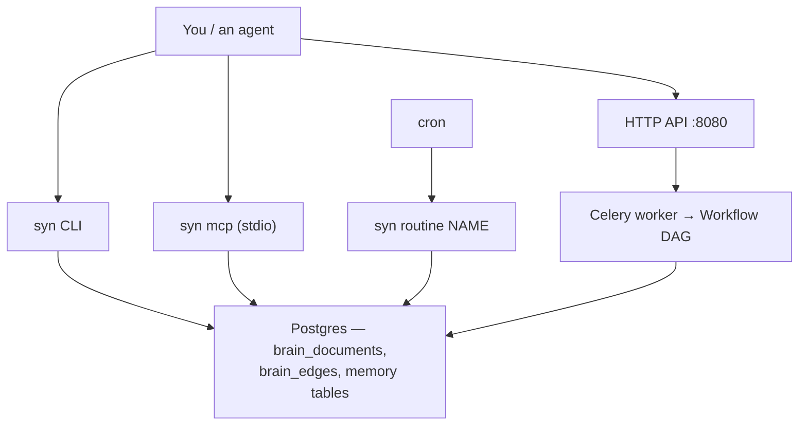

# Capability Catalogue

Everything this repo can do, in one list, with how to invoke it. Derived from source —
[`app/workflows/workflow_registry.py`](../app/workflows/workflow_registry.py),
[`app/brain/cli.py`](../app/brain/cli.py), [`app/api/router.py`](../app/api/router.py), and
`ROUTINES` in [`app/brain/ops.py`](../app/brain/ops.py) — not from doc titles.

## What this page is for

You know what Synapse is (the **Brain**: corpus, embeddings, structural graph, memory, retrieval)
and you want to make it do something. This page answers "what can it do, and what do I type."
Each row links to the doc that explains the thing in depth.

If you are new to the repo entirely, run [getting-started.md](getting-started.md) first — nothing
below works until Postgres, Redis and the API are up.

## Quickstart

```bash
uv sync                                              # from the repo root
cd app && alembic upgrade head                       # create the tables
uv run syn pulse                                     # is the corpus alive?
uv run syn recall "how does age decay work"          # ask the brain a question
```

Those four lines are typed in a **terminal**. Nothing in this repo is a Claude Code slash command.

To also serve the HTTP surface (needed for the workflows and for `bastion`):

```bash
cd app && uv run uvicorn main:app --host 0.0.0.0 --port 8080 --reload   # terminal 1
cd app && uv run celery -A worker.config.celery_app worker --loglevel=info   # terminal 2
```

## The four surfaces



1. **The `syn` CLI** is the everyday surface — read the corpus, rebuild it, score retrieval.
2. **The HTTP API** on port 8080 is how other processes reach the Brain: `engine-rs` hands
   artifacts over `POST /ingest/*`, and `bastion` reads `GET /recall|/walk|/pulse`.
3. **`syn mcp`** exposes the read path to any MCP client over stdio.
4. **`syn routine <name>`** is the unattended path — a fixed set of chores safe to run from cron.

Only the HTTP API runs workflows. The CLI and MCP paths talk to Postgres directly.

---

## Workflows

Four are registered. A workflow is an event-driven DAG of nodes; you start one by POSTing an event
and poll for the result. Payload shapes, node graphs and copy-pasteable curl calls:
[workflows.md](workflows.md).

| Workflow | What it does | How to run it |
|---|---|---|
| `DOCUMENT_INGEST` | Chunks and embeds a document into the corpus so it becomes searchable. | `POST /events/` with `workflow_type: DOCUMENT_INGEST` |
| `DOCUMENT_QA` | Answers a natural-language question against the corpus, with citations and an abstain gate. | `POST /events/` with `workflow_type: DOCUMENT_QA` |
| `MEMORY_INGEST` | Turns a raw episode (what an agent did, what a peer said) into stored memory. | `POST /events/` with `workflow_type: MEMORY_INGEST` |
| `MEMORY_CONSOLIDATION` | Distils accumulated episodes into durable semantic memory, decaying confidence over time. | `POST /events/` with `workflow_type: MEMORY_CONSOLIDATION` |

The memory pair is explained in [memory.md](memory.md); the retrieval that `DOCUMENT_QA` runs is
explained in [brain-rag.md](brain-rag.md).

**Adding one:** run `uv run createworkflow`, then register it in **both**
[`app/workflows/workflow_registry.py`](../app/workflows/workflow_registry.py) and
[`app/api/schema_registry.py`](../app/api/schema_registry.py) — missing the second makes the API
422 every request for that workflow. New execution-shaped workflows belong in `engine-rs`, not
here; run the boundary test in `CLAUDE.md` first.

---

## The `syn` CLI

Installed by `uv sync` as the `syn` console script
([`pyproject.toml`](../pyproject.toml) `[project.scripts]`). Every command takes `--json` for
machine-parseable output. Full flag reference: [scripts.md](scripts.md) § `syn`.

### Read the brain

| Command | What it does |
|---|---|
| `syn recall QUERY` | Search the corpus. `--corpus brain\|code\|content` picks which one; `--hybrid` adds keyword+semantic fusion; `--workspace NAME` scopes to one repo. |
| `syn walk DOC_ID` | Follow the structural graph out from one document — `--depth N` hops through `brain_edges`. |
| `syn pulse` | One-shot health report on the corpus and its substrate: row counts, index freshness. |
| `syn queries` | Read the real retrieval traffic logged in `retrieval_queries`. `--since 7d`, `--abstained`. |
| `syn queries mine` | Propose golden-set candidates from that traffic. Prints YAML to stdout; never writes the golden set. |

### Rebuild the brain

| Command | What it does | Danger |
|---|---|---|
| `syn embed FILE` | Re-embed one markdown file. | writes |
| `syn ingest --dir DIR` | Index every markdown file under a directory. | writes |
| `syn refresh` | The normal rebuild — refreshes `brain_documents` **and** `brain_edges`. `--rebuild` re-indexes from scratch. | writes; `--dry-run` available |
| `syn prune PATH...` | **Deletes** corpus rows for files that no longer exist. | **destructive** — use `--dry-run` first |
| `syn stale` | Report corpus drift. `--assert-clean` exits non-zero on any. `--deep` checks five axes; `--deep --repair` fixes what it can. | read-only unless `--repair` |

`syn refresh` is the one to reach for by default; prefer it over calling
[`scripts/index_brain.py`](../scripts/index_brain.py) and
[`scripts/load_brain_edges.py`](../scripts/load_brain_edges.py) by hand.

### Measure retrieval

| Command | What it does |
|---|---|
| `syn eval` | Score the golden set and write a dated run file under `planning/retrieval-eval-runs/`. Diffs against the promoted baseline and exits non-zero on a significant regression. |
| `syn eval --no-write` | Same scoring, zero files written — the throwaway-experiment form. |
| `syn eval --report [PATH]` | Render a scrubbed, publishable Markdown report of the run. |
| `syn eval promote RUN --reason "..."` | Promote a run file to the baseline pin. `--reason` is required. |

**Before comparing any two runs, read the rules in `CLAUDE.md` § "Brain RAG measurement".** Run
files record metrics but not the corpus they were measured against; two past blocks drew wrong
conclusions from that.

### Serve

| Command | What it does |
|---|---|
| `syn mcp` | Serve the Brain read path (`brain_recall`, `brain_walk`, `brain_pulse`) as an MCP server over stdio. Contract: [mcp-contract.md](mcp-contract.md). |

---

## HTTP API

Served by [`app/main.py`](../app/main.py) on port 8080. Routes are mounted in
[`app/api/router.py`](../app/api/router.py). Anything marked **key** requires an `X-API-Key`
header; see [`app/api/security.py`](../app/api/security.py) and
[configuration.md](configuration.md).

| Route | Auth | What it does |
|---|---|---|
| `GET /health` | open | Readiness probe. |
| `GET /workflows` | open | List every registered workflow type. |
| `GET /workflows/{type}/graph` | open | The node DAG for one workflow, for inspection. |
| `POST /events/` | key | Start a workflow run. Returns an event id immediately; the Celery worker does the work. |
| `GET /events/{event_id}` | key | Fetch that run's state and `task_context`. |
| `GET /recall?q=…` | key | Corpus search — the HTTP twin of `syn recall`. `limit` ≤ 50, `hybrid` optional. |
| `GET /walk?doc_id=…` | key | Graph traversal — the HTTP twin of `syn walk`. `depth` ≤ 5. |
| `GET /pulse` | key | Corpus health — the HTTP twin of `syn pulse`. |
| `POST /ingest/proposal` | key | Accept a generated proposal from `engine-rs` and file it into the corpus. |
| `POST /ingest/artifact` | key | Accept any other repo-facing artifact from `engine-rs`. |

The `/recall`, `/walk`, `/pulse` and `/events` shapes are **versioned and pinned** by consumers —
`bastion` reads them. Changing a field means bumping [data-contract.md](data-contract.md) and
re-pinning the consumer copies; `tests/api/test_read_contract.py` fails if you do not.

The `/ingest/*` endpoints are the D51 seam: `engine-rs` acquires and reasons, then hands the
artifact over. Synapse owns everything behind the endpoint.

---

## Ops routines

`syn routine <name>` runs one named chore. This is the cron surface, so the registry in
[`app/brain/ops.py`](../app/brain/ops.py) is deliberately short and every entry is safe to run
unattended.

| Routine | What it does |
|---|---|
| `refresh` | Rebuild `brain_documents` + `brain_edges`. |
| `stale` | Report corpus drift. |
| `reconcile` | Deep five-axis drift check — **report-only**; never repairs from cron. |
| `eval` | Score the golden set — **report-only**. |
| `queries_prune` | **Deletes** `retrieval_queries` rows past the retention window (`$BRAIN_QUERY_LOG_KEEP_DAYS`, default 90). The one destructive routine, and deliberately so. |

`reconcile` and `eval` are report-only because repairing and writing are judgement-shaped work that
must not run without a human. Retention is not: it is a bounded, idempotent delete.

---

## Scripts

Everything under `scripts/`. The `syn` CLI supersedes most of them for day-to-day use; reach for a
script when you need a flag `syn` does not expose. Full reference: [scripts.md](scripts.md).

| Script | What it does |
|---|---|
| `scripts/dev-setup.sh` | One-time local setup — Postgres, Redis, the database. |
| `scripts/dev.sh` | Start the API and the Celery worker together in a tmux session. |
| [`index_brain.py`](../scripts/index_brain.py) | Crawl every `brain.toml` repo's markdown into `brain_documents`. Behind `syn ingest` / `syn refresh`. |
| [`index_code.py`](../scripts/index_code.py) | Crawl those repos' **source trees** into `code_chunks` — the `code` corpus behind `syn recall --corpus code`. |
| [`load_brain_edges.py`](../scripts/load_brain_edges.py) | Build the structural graph (`brain_edges`) from OKF `related:` frontmatter. Behind `syn refresh`. |
| [`query_brain.py`](../scripts/query_brain.py) | Thin caller over `app/brain/retrieval.py` — manual retrieval testing. `syn recall` is the better entry point. |
| `scripts/inspect_run.py` | Dump one workflow run's `task_context` and node outputs for debugging. |
| [`ingest_repo_log.py`](../scripts/ingest_repo_log.py) | Ingest this repo's `log.md` into the memory tier. |
| `scripts/check_block_records.py` | Validate block records against `block.schema.json`. |

Four of these are **untracked and machine-local** — `dev-setup.sh`, `dev.sh`, `inspect_run.py`
and `check_block_records.py` are gitignored, so they exist on this machine but not on GitHub.

Two further scripts are **one-off chore helpers**, kept for provenance and not part of the running system:
`apply_business_docs_project_frontmatter.py` and `count_business_docs_null_project.py`.
`sweep_ranking.py` is machine-local and gitignored on purpose.

## Not here

Synapse is the Brain, not the Engine. Execution workflows, client-facing artifacts, PRs and code
generation live in `engine-rs`; document serialization lives in `mev` / `okf-core`. The boundary
test that decides which repo owns a piece of work is at the top of `CLAUDE.md`, and it is
byte-identical in `core/engine-rs/CLAUDE.md`.

## See also

- [index.md](index.md) — the full documentation index.
- [getting-started.md](getting-started.md) — get the stack running.
- [api-reference.md](api-reference.md) — class-level reference for the abstractions you subclass.
- [app-architecture-overview.md](app-architecture-overview.md) — how FastAPI → Celery → DAG fits together.
