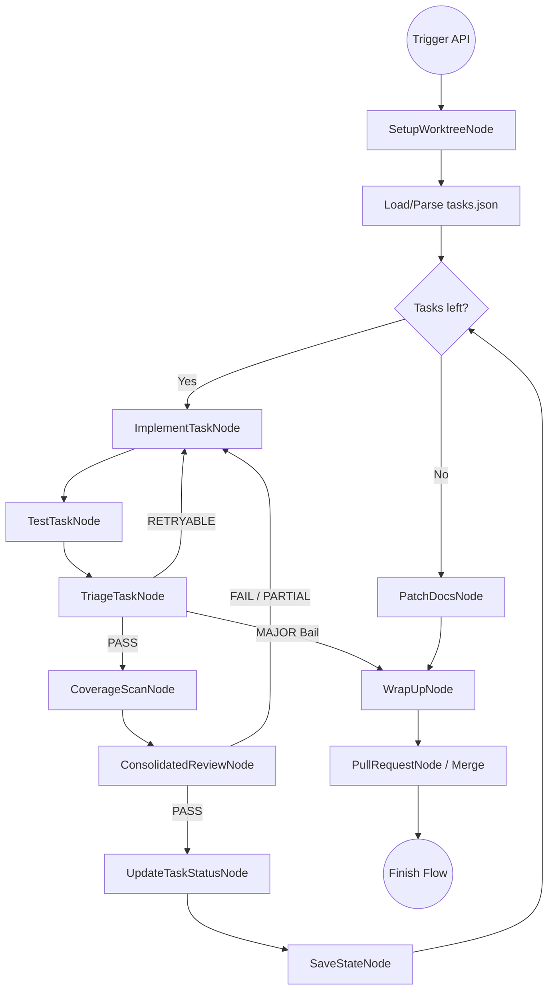

# Architectural Synthesis: SDLC Pipeline as Python-Native Workflow DAG

This document synthesizes the transition from the legacy JavaScript-based `/sdlc-flow` execution engines and `adws` subprocess CLI wrappers into a native, high-performance Python orchestration engine. By leveraging the existing `app/core/nodes/` framework (FastAPI + Celery + DAG execution) and direct SDK integrations (`ClaudeCodeModel`), we establish a robust, state-machine-driven agentic SDLC.

---

## 1. Task Generation & Machine-Parsable Schema

### Structured JSON vs Markdown Tasks
Currently, `/generate-tasks` yields a Markdown file (`tasks.md`) with `### N.` headers, forcing downstream stages (and `EnumerateTasksNode`) to rely on regex parsing. To make the pipeline machine-parsable and resilient, we will migrate to a structured JSON task schema. 

The `GenerateTasksNode` (driven by a Frontier model like Claude 3.5 Sonnet or Opus) will output a schema strictly aligned with our orchestration `state.json` (or `sdlc-flow-state.json`):

```json
{
  "spec_slug": "auth-refactor",
  "phase_id": "1",
  "block_id": "auth-core",
  "global_status": "in_progress",
  "tasks": [
    {
      "task_id": 1,
      "title": "Implement JWT Middleware",
      "description": "Create a FastAPI middleware to validate JWT tokens and extract user context.",
      "acceptance_criteria": [
        "Middleware intercepts 401 on invalid token.",
        "User ID is injected into `request.state.user`."
      ],
      "status": "pending", 
      "validation_commands": ["pytest tests/api/test_auth_gate.py"]
    }
  ],
  "telemetry": {
    "total_attempts": 0,
    "budget_spent": 0.0
  }
}
```

### Task List Ingestion
Rather than `EnumerateTasksNode` using regex over markdown, the workflow will use a `LoadTaskStateNode` to deserialize the `tasks.json` file into a Pydantic model (`WorkflowSpecSchema`). 
- **Tracing Progress:** The `UpdateTaskStatusNode` becomes a pure JSON state mutation (`task.status = "done" | "failed"`).
- **Persistence:** This JSON state replaces `tasks.md` as the source of truth, aligning perfectly with `TaskContext.data` injections. `SaveStateNode` will dump this state to `planning/<slug>/sdlc-flow-state.json` and commit it.

---

## 2. Slash Command Logic & State Integration

### The Command Suite Mapping
Legacy manual slash commands map to automated pipeline Nodes:
- **`/generate-master-plan` & `/generate-tasks`:** Mapped to `GenerateMasterPlanNode` and `GenerateTasksNode` (Phase 1 execution). Outputs `plan.json` and `tasks.json`.
- **`/implement`:** Mapped to `ImplementTaskNode`. Given `task_id` and context, authors modifications.
- **`/test`:** Mapped to `TestTaskNode`. Executes `planning/harness.json` suites locally.
- **`/review-task` / `/review`:** Mapped to `ConsolidatedReviewNode`. Evaluates the git diff against the JSON `acceptance_criteria`.
- **`/fix`:** Eliminated as a standalone command; represented as the cyclic DAG route from `TriageTaskNode` ➔ `ImplementTaskNode` (Retry Loop).
- **`/wrap-up` / `/log-work`:** Mapped to `WrapUpNode`. Synthesizes run logs, edits `status.md`, appends to `log.md`.

### Piping Commands in Python
The legacy `adws` wrapper and `.claude/workflows/*.js` relied on `child_process.exec()` or `subprocess.Popen` to invoke the `claude` CLI and intercept its stdout streams.
**The New Paradigm:** We bypass the CLI layer entirely. `ImplementTaskNode` utilizes the `ClaudeCodeModel` class, hooking directly into the `ModelProvider.CLAUDE_CODE_SDK` or `BastionSessionBackend`. 
- **In-Memory Context:** File modifications are executed natively via tool use (e.g., `bash`, `str_replace`).
- **Telemetry:** Token usage, latency, and tool calls are captured natively via the SDK response objects, injected immediately into `TaskContext.data["telemetry"]`.

---

## 3. Translation of JS Engines to Python Nodes

### Design Alignment & Missing Stages
Reviewing `docs/sdlc-workflow-nodes-design.md` against `sdlc-flow.js`, the blueprint is functionally accurate but requires augmentation:
1. **Quality Close / Coverage Gap-Check:** `sdlc-flow.js` triggers `/close-out` which includes a test coverage scan. We must introduce a `CoverageScanNode` between `TestTaskNode` and `ConsolidatedReviewNode` to auto-generate tests for uncovered logic diffs.
2. **UI Smoke Test Gate:** If `harness.json` defines a `uiTest` check, we need a distinct `UITestNode` (or conditional logic in `TestTaskNode`).
3. **Telemetry Capture:** `SaveStateNode` needs a structured input from `TaskContext.telemetry` (updated continuously by `ClaudeCodeModel`) to write the cost reports (`worklog.md` financial summaries).
4. **State Mutation:** `UpdateTaskStatusNode` must mutate Pydantic JSON structures instead of markdown checkboxes.

### Engine API Seams
Using `docs/api-reference.md`:
- **`WorkflowSchema`:** Defines `start = SetupWorktreeNode` and the full `NodeConfig` array.
- **`Node` & `AgentNode`:** `TestTaskNode` (Subprocess execution) inherits from `Node`. `ImplementTaskNode` and `ConsolidatedReviewNode` inherit from `AgentNode` (LLM-driven).
- **`RouterNode`:** `TriageTaskNode` implements `BaseRouter` to dynamically set `_get_next_node_class()` to either `ImplementTaskNode` (Retry) or `WrapUpNode` (Bail).
- **`TaskContext`:** The universal state bus. Carries `worktree_path`, `task_queue`, `current_task`, and `test_logs`.

---

## 4. Git & Worktree Lifecycle

### Workspace Management
`SetupWorktreeNode` isolates execution safely:
1. **Branching:** `git worktree add trees/<branch_name> -b <branch_name> origin/main`.
2. **Sparse Checkout:** `git sparse-checkout init --cone` and `git sparse-checkout set <required_dirs>` to keep the context size minimal and safe.
3. **Clean-up:** Handled by `PullRequestNode` (if auto-merging) or a dedicated `TeardownWorktreeNode` triggered on `MAJOR` bail.

### Isolation and Port Mapping
To allow `sdlc-block.js`-style parallel execution (branch trains):
- **Port Assignment:** `SetupWorktreeNode` inspects active ports (e.g., via `psutil` or a port registry) and allocates unused ports. It writes a local `.ports.env` file in the worktree.
- **Database Collisions:** The harness configuration must support dynamic `DB_URL` overrides (e.g., SQLite file per worktree or isolated Postgres schemas).
- **Celery Concurrency:** Celery workers handle tasks in parallel. `worktree_path` ensures file-system operations inside `TestTaskNode` (like `pytest`) do not bleed across active DAG runs.

---

## 5. The Validation & Harness Engine

### `harness.json` Mapping
`TestTaskNode` serves as the executor for the project-specific validation suite, parsing `planning/harness.json`:
1. **`command`:** Standard `subprocess.run(check.command, cwd=worktree_path)`. Fails if exit code != 0.
2. **`baseline-diff`:** Prior to implementation, a snapshot of test output is captured to a temporary JSON. Post-implementation, output is captured again. A Python diff isolates net-new failures, ignoring pre-existing tech debt.
3. **`count-delta`:** Regex matching on stdout (e.g., `# of type errors`). Fails if count > baseline.
4. **`warning-scan`:** Scans stderr/stdout for `WARN` or `DeprecationWarning` patterns configured in the harness.
5. **`forbidden-pattern-scan`:** Executes `grep` (or Python equivalent) against the git diff to ensure no banned imports (e.g., `import os` when `pathlib` is mandated).
6. **`emoji-gate`:** A strict git diff regex scan (`[^\x00-\x7F]`) against Markdown files to prevent stray LLM emojis.

---

## 6. Retry, Triage, and Model Tiering

### Triage and Loop Control
`TriageTaskNode` (a `RouterNode`) parses `TestTaskNode` stdout:
- **`RETRYABLE` (Route: `ImplementTaskNode`):** Syntax errors, failing unit tests, type mismatch. Increments attempt counter.
- **`MAJOR` (Route: `WrapUpNode` / Bail):** Environment missing, infinite hang, missing dependencies not specified in spec, or `max_attempts` reached (usually 3). Exits the block execution gracefully to avoid burning API budget.

### Model Tiering & Escalation
Configured dynamically per node instantiation (Hardware Strategy):
- **Haiku / 8B Local:** `SetupWorktreeNode`, `LoadTaskStateNode`, `UpdateTaskStatusNode`, `TestTaskNode`, `SaveStateNode`, `PullRequestNode`. Extremely fast, deterministic logic.
- **Sonnet / 32B Local:** `TriageTaskNode` (Categorizing logs), `PatchDocsNode` (Markdown updates), `WrapUpNode` (Synthesizing commits).
- **Claude 3.5 Sonnet (Cloud):** `ImplementTaskNode`. Requires the deepest context window, highest coding benchmark, and robust tool-use for codebase mutation.
- **Opus / Gemini Pro (Cloud):** `GenerateTasksNode` (Planning & Architecture), `ConsolidatedReviewNode` (Authoritative judging, identifying subtle logic bugs in diffs).

---

## 7. Unified Data Flow Map

Below is the step-by-step sequence mapping the execution flow of an SDLC block:



### Execution Lifecycle Summary
1. **Init:** `POST /events/` triggers the Celery task. `SetupWorktreeNode` isolates the environment.
2. **Ingest:** JSON task list is loaded. Iteration begins.
3. **Loop:** For each task, `ClaudeCodeModel` implements changes. The `harness.json` test suite executes.
4. **Triage:** Failures route back to implementation; passes proceed to coverage gap-check and LLM-as-a-judge review.
5. **Commit:** `UpdateTaskStatusNode` mutates the JSON state to `done`, `SaveStateNode` commits progress.
6. **Completion:** Docs are patched, `status.md` and `log.md` are updated, and the PR is opened or auto-merged.
